# Backend ↔ ldm_patched ↔ modules — Authoritative Dependency Map

**Date:** 2026-02-25  
**Purpose:** Single source of truth for what the backend provides, what `ldm_patched` and `modules/` still import, and what remains to be extracted.  
**Trigger:** W01 post-mortem — 2 rollbacks caused by undocumented import graph.

---

## Architecture Overview

```mermaid
graph TD
    subgraph "Layer 3 — modules/ (Fooocus UI)"
        AW["async_worker.py"]
        CORE["core.py"]
        DP["default_pipeline.py"]
        PATCH["patch.py"]
        PC["patch_clip.py"]
        PP["patch_precision.py"]
        UP["upscaler.py"]
        UP["upscaler.py"]
    end

    subgraph "Layer 2 — backend/ (Nex Native)"
        LOADER["loader.py"]
        SAMP["sampling.py"]
        SCHED["schedulers.py"]
        PATCH_B["patching.py"]
        RES["resources.py"]
        CLIP_B["clip.py"]
        LORA_B["lora.py"]
        WO["weight_ops.py"]
        UTILS_B["utils.py"]
        KD["k_diffusion.py"]
        COND["conditioning.py"]
        DEC["decode.py"]
        FLOAT["float_ops.py"]
        ANISO["anisotropic.py"]
        PREC["precision.py"]
        GGUF_B["gguf/ (loader, ops, patcher)"]
        OPS_B["ops.py"]
    end

    subgraph "Layer 1 — ldm_patched/ (ComfyUI Fork)"
        MM["model_management.py"]
        MP["model_patcher.py"]
        MB["model_base.py"]
        SD["sd.py"]
        MS["model_sampling.py"]
        OPS_L["ops.py"]
        CTRL["controlnet.py"]
        MD["model_detection.py"]
        LF["latent_formats.py"]
        UT["utils.py"]
        S1C["sd1_clip.py"]
        CP["checkpoint_pickle.py"]
        WA["weight_adapter/"]
        HOOKS["hooks.py"]
        FLOAT_L["float.py"]
        LDM["ldm/ (UNet, VAE, attention)"]
        PFN["pfn/ (ESRGAN)"]
        CLDM["controlnet/cldm.py"]
    end

    %% modules → backend (GOOD — intended direction)
    CORE --> LOADER
    CORE --> SAMP
    CORE --> COND
    CORE --> DEC
    CORE --> RES
    CORE --> PREC
    CORE --> LORA_B
    DP --> RES
    DP --> SCHED
    DP --> LORA_B
    PATCH --> KD
    LOADER --> GGUF_B
    PC --> OPS_B

    %% modules → ldm_patched (TO BE REDUCED)
    CORE -.-> SD
    CORE -.-> MM
    CORE -.-> MP
    CORE -.-> MD
    CORE -.-> LF
    CORE -.-> MS
    CORE -.-> CTRL
    DP -.-> MB
    PATCH -.-> MB
    PATCH -.-> MM
    PATCH -.-> SD
    PATCH -.-> MP
    PATCH -.-> LDM
    PATCH -.-> CLDM
    PC -.-> MM
    PC -.-> MB
    PC -.-> SD
    PC -.-> MP
    PC -.-> S1C
    PC -.-> OPS_L
    PC -.-> LDM
    PC -.-> CLDM
    PP -.-> LDM
    PP -.-> MS
    PP -.-> S1C
    UP -.-> MM
    UP -.-> UT
    UP -.-> PFN

    %% backend → ldm_patched (VIOLATIONS — to be eliminated)
    LOADER -.-> MB
    LOADER -.-> LF
    LOADER -.-> LDM
    LORA_B -.-> MB
    LORA_B -.-> WA
    WO -.-> WA
    UTILS_B -.-> CP
    SCHED -.-> LF
    GGUF_B -.-> UT
    GGUF_B -.-> MM
    GGUF_B -.-> OPS_L
    GGUF_B -.-> FLOAT_L

    %% backend → modules (CLEAN!)
```



> [!NOTE]
> **Solid arrows** = intended dependency direction (modules → backend).  
> **Dashed arrows** = `ldm_patched` dependencies that still exist and should be reduced.  
> **Orange nodes** = backend files that still import from `ldm_patched` (violations).

---

## Section 1: What Backend Already Provides

Each backend module and its purpose — these are **fully extracted** and own their functionality.

| Module | Purpose | Lines | Depends on ldm_patched? |
|---|---|---|---|
| `resources.py` | VRAM/device management, model loading/unloading, memory tracking | 851 | ❌ No |
| `sampling.py` | KSampler, sigmas, conditioning orchestration, sample_sdxl entry point | 396 | ❌ No |
| `k_diffusion.py` | All sampler functions (euler, dpm++, heun, etc.), noise scheduling | 1030+ | ❌ No |
| `schedulers.py` | Scheduler functions (normal, karras, exponential, turbo, AYS) | 191 | ⚠️ **Yes** — `latent_formats` in AYS |
| `patching.py` | `NexModelPatcher` — weight patching, model memory management | 608 | ❌ No |
| `weight_ops.py` | `calculate_weight`, weight adapters, LoRA weight application | 280 | ⚠️ **Yes** — `weight_adapter` |
| `lora.py` | LoRA key mapping, loading, applying patches | 440 | ⚠️ **Yes** — `model_base`, `weight_adapter` |
| `loader.py` | SD1.5/SDXL checkpoint loading, CLIP/VAE containers | 489 | ⚠️ **Yes** — `model_base`, `latent_formats`, autoencoder |
| `clip.py` | CLIP text encoding (SDXL L+G, SD1.5) | 750+ | ❌ No (inlined attention) |
| `conditioning.py` | Conditioning preparation (positive/negative) | 120 | ❌ No |
| `decode.py` | VAE decode, tiled decode | 150 | ❌ No |
| `cond_utils.py` | Condition batching, area/mask helpers | 260 | ❌ No |
| `float_ops.py` | FP8/BF16 detection and casting utilities | 65 | ❌ No |
| `precision.py` | dtype selection logic | 45 | ❌ No |
| `utils.py` | Safe tensor loading, checkpoint unpickling | 180 | ⚠️ **Yes** — `checkpoint_pickle` |
| `anisotropic.py` | Anisotropic sharpness filter | 170 | ❌ No |
| `ops.py` | `use_patched_ops` context manager for manual cast | 20 | ❌ No |
| `defs/sdxl.py` | SDXL UNet config dict | — | ❌ No |
| `defs/sd15.py` | SD 1.5 UNet config dict | — | ❌ No |

**Summary:** 13 of 18 backend modules are fully independent. **5 modules still have `ldm_patched` imports.**

---

## Section 2: Backend → ldm_patched Violations (5 imports to eliminate)

These are the backdoor dependencies that keep the backend from being fully standalone.

### 2.1 `backend/loader.py` → `ldm_patched.modules.model_base`, `latent_formats`, `autoencoder`

```python
from ldm_patched.modules import model_base, latent_formats, supported_models_base
from ldm_patched.ldm.models.autoencoder import AutoencoderKL, AutoencodingEngine
```

**Why it exists:** `loader.py` creates `ModelConfig` inheriting from `supported_models_base.BASE`, and uses `latent_formats.SD15()`/`latent_formats.SDXL()` for VAE scaling. The autoencoder classes are the actual VAE model definitions.

**What it relates to:** Model instantiation — the UNet, CLIP, and VAE all need architecture definitions that currently live in `ldm_patched/ldm/`.

**Extraction path:** These are **deep structural dependencies** — the actual PyTorch model class definitions. Moving them requires extracting `ldm_patched/ldm/models/autoencoder.py` and `ldm_patched/modules/latent_formats.py`. **Phase 4** scope.

---

### 2.2 `backend/loader.py` → `backend/gguf/` (Clean Native Dependency)

```python
from backend.gguf.loader import gguf_sd_loader
from backend.gguf.ops import GGMLOps
from backend.gguf.patcher import GGUFModelPatcher
```

**Status:** ✅ **Eliminated** circular dependency in M11-W02. GGUF is now a backend child package.

---

### 2.3 `backend/lora.py` → `ldm_patched.modules.model_base`, `weight_adapter`

```python
import ldm_patched.modules.model_base
import ldm_patched.modules.weight_adapter as weight_adapter
```

**Why it exists:** LoRA key mapping uses `isinstance()` checks against `model_base.SDXL`, `model_base.BaseModel`, etc. to select the right key prefix. `weight_adapter` defines the LoRA/LoCon weight application logic.

**What it relates to:** LoRA loading — needs to know model architecture to map keys correctly.

**Extraction path:** The `model_base` isinstance checks can be replaced with a string-based model type flag (**M11-W03**). `weight_adapter` is a larger extraction (**Phase 4**) — it's 7 files with type-specific adapters.

---

### 2.4 `backend/weight_ops.py` → `ldm_patched.modules.weight_adapter`

```python
import ldm_patched.modules.weight_adapter as weight_adapter  # lazy import
```

**Why it exists:** `calculate_weight()` delegates to `weight_adapter` for LoRA/LoCon/LoHa weight types.

**What it relates to:** Weight patching — the math for applying different adapter types.

**Extraction path:** Same as 2.3 — `weight_adapter` extraction is a **Phase 4** task due to its complexity (7 source files, type-specific logic).

---

### 2.5 `backend/utils.py` → `ldm_patched.modules.checkpoint_pickle`

```python
import ldm_patched.modules.checkpoint_pickle
```

**Why it exists:** Safe unpickling of `.ckpt` files (restricts which classes can be deserialized).

**What it relates to:** Checkpoint loading safety — a 7-line guard module.

**Extraction path:** **M11-W03** — trivial inline (copy 7 lines into `backend/utils.py`).

---

### 2.6 `backend/schedulers.py` → `ldm_patched.modules.latent_formats`

```python
import ldm_patched.modules.latent_formats  # line 136, inside align_your_steps_scheduler()
```

**Why it exists:** AYS scheduler needs the latent format's `scale_factor` to compute correct sigma values.

**What it relates to:** A scheduler function needs a single constant from the latent format.

**Extraction path:** **M11-W03** — pass `scale_factor` as parameter instead of importing the module.

---

## Section 3: modules/ → ldm_patched Dependencies (The Heavy Consumers)

These are the `modules/` files that still reach into `ldm_patched`. They represent the **main refactoring frontier**.

### 3.1 `modules/core.py` (heaviest consumer — 9 imports)

| Import | What it uses | Status |
|---|---|---|
| `ldm_patched.modules.sd.load_checkpoint_guess_config` | Full checkpoint loading (Fooocus UI path) | Active — primary model loader for UI |
| `ldm_patched.modules.model_management` | `interrupt_current_processing()`, memory queries | Active — interrupt handling |
| `ldm_patched.modules.model_patcher` | Type references | Active — used in function signatures |
| `ldm_patched.modules.model_detection` | Auto-detect model architecture | Active — for `load_checkpoint_guess_config` |
| `ldm_patched.modules.latent_formats` | VAE scaling factors | Active — used in inlined FreeU_V2 |
| `ldm_patched.modules.model_sampling` | ModelSamplingDiscrete | Active — for inlined ModelSampling node |
| `ldm_patched.modules.controlnet` | ControlNet loading | Active — ControlNet support |
| `ldm_patched.modules.sd` | CLIP/VAE container types | Active — model management |

**Outlook:** `core.py` is the bridge between the Fooocus UI and the inference pipeline. Its `ldm_patched` usage is legitimate for now — it orchestrates the full ComfyUI-derived pipeline. Reducing these imports requires either (a) routing all UI model loading through `backend/loader.py` or (b) extracting the remaining `ldm_patched` modules. Both are **Phase 4** objectives.

---

### 3.2 `modules/patch.py` (monkey-patch layer — 8 imports)

| Import | What it uses |
|---|---|
| `ldm_patched.modules.model_base` | `isinstance` checks for SDXL |
| `ldm_patched.modules.model_management` | `DISABLE_SMART_MEMORY` flag |
| `ldm_patched.modules.sd` | Module-level monkey-patching |
| `ldm_patched.modules.model_patcher` | `ModelPatcher` monkey-patching |
| `ldm_patched.modules.args_parser` | `args` config access |
| `ldm_patched.ldm.modules.attention` | Attention monkey-patching |
| `ldm_patched.ldm.modules.diffusionmodules.model` | ResBlock monkey-patching |
| `ldm_patched.ldm.modules.diffusionmodules.openaimodel` | `timestep_embedding` |
| `ldm_patched.controlnet.cldm` | ControlNet patching |

**Outlook:** `patch.py` applies Fooocus-specific quality enhancements (anisotropic sharpness, ControlNet softness) by monkey-patching `ldm_patched` internals. This file **cannot be simplified without extracting the underlying model architecture** from `ldm_patched/ldm/`. **Phase 4**.

---

### 3.3 `modules/patch_clip.py` (precision patches — 14 imports)

| Import | What it uses |
|---|---|
| `ldm_patched.modules.model_management` | Device/dtype queries |
| `ldm_patched.modules.model_base` | `isinstance` checks |
| `ldm_patched.modules.model_patcher` | `ModelPatcher` patching |
| `ldm_patched.modules.sd` | CLIP container patching |
| `ldm_patched.modules.sd1_clip` | Tokenizer/encoder patching |
| `ldm_patched.modules.clip_vision` | CLIP vision patching |
| `ldm_patched.modules.ops` | Operator overrides |
| `ldm_patched.modules.args_parser` | Config access |
| `ldm_patched.ldm.modules.attention` | Attention patching |
| `ldm_patched.ldm.modules.diffusionmodules.model` | ResBlock patching |
| `ldm_patched.ldm.modules.diffusionmodules.openaimodel` | UNet patching |
| `ldm_patched.controlnet.cldm` | ControlNet patching |

**Outlook:** Kohya-style precision consistency patches. These directly modify `ldm_patched` class internals. **Cannot be decoupled without extracting the model architecture.** Phase 4.

---

### 3.4 `modules/patch_precision.py` (3 imports)

| Import | What it uses |
|---|---|
| `ldm_patched.ldm.modules.diffusionmodules.openaimodel` | UNet forward monkey-patch |
| `ldm_patched.modules.model_sampling` | Beta schedule access |
| `ldm_patched.modules.sd1_clip` | Tokenizer patching |

**Outlook:** Fixes precision issues for SD1.5. Phase 4.

---

### 3.5 `backend/gguf/` (moved from modules)

| File | Import | What it uses |
|---|---|---|
| `patcher.py` | `ldm_patched.modules.utils` | `set_attr` helper |
| `patcher.py` | `ldm_patched.modules.model_management` | Device queries |
| `patcher.py` | `ldm_patched.modules.float` | FP8 casting |
| `ops.py` | `ldm_patched.modules.ops` | Operator base classes |
| `ops.py` | `ldm_patched.modules.model_management` | Device queries |

**Outlook:** Moved to backend in M11-W02. The `ldm_patched` imports inside them remain. Replacing `model_management` with `backend/resources` and `utils` with `backend/utils` is feasible in W03.

---

### 3.6 Other `modules/` files

| File | ldm_patched imports | Notes |
|---|---|---|
| `upscaler.py` | `model_management`, `utils`, `pfn.architecture.RRDB` | ESRGAN upscaling |
| `default_pipeline.py` | `model_base.SDXL`, `model_base.BaseModel` | Model type detection |
| `lora.py` | None (DELETED) | Accomplished in M11-W02 |

---

## Section 4: ldm_patched Modules — Categorized by Extraction Priority

### 4.1 Safe to Extract Now (M11 scope)

| Module | Size | Used by | Extraction target |
|---|---|---|---|
| `checkpoint_pickle.py` | 7 lines | `backend/utils.py` | Inline into `backend/utils.py` |
| `latent_formats.py` | 95 lines | `backend/loader.py`, `backend/schedulers.py`, `modules/core.py` | Copy to `backend/latent_formats.py` |

### 4.2 Extract After GGUF Move (M11-W02/W03)

| Module | Size | Used by | Notes |
|---|---|---|---|
| `float.py` | 65 lines | `modules/gguf/patcher.py` | Already has `backend/float_ops.py` — redirect GGUF import |
| `utils.py` | 500 lines | `modules/gguf/patcher.py`, `modules/upscaler.py` | Partial — only `set_attr` and `load_torch_file` used |

### 4.3 Phase 4 — Deep Structural (requires model arch extraction)

| Module | Size | Why it's hard |
|---|---|---|
| `model_base.py` | 500 lines | Defines SDXL/SD15/SVD model classes — everything depends on it |
| `model_patcher.py` | 1600 lines | Core weight patching — `NexModelPatcher` is a partial extract |
| `model_management.py` | 1300 lines | VRAM state machine — `backend/resources.py` is a partial extract |
| `sd.py` | 680 lines | CLIP/VAE containers, `load_checkpoint_guess_config` |
| `ops.py` | 460 lines | Custom linear/conv operators with automatic dtype casting |
| `model_detection.py` | 470 lines | Auto-detect model architecture from state dict |
| `controlnet.py` | 560 lines | ControlNet loading and application |
| `hooks.py` | 850 lines | Model hook system |
| `weight_adapter/` | 7 files | LoRA/LoCon/LoHa/LoKr adapter implementations |

### 4.4 Likely Never Extracted (model architecture definitions)

| Directory | Purpose | Notes |
|---|---|---|
| `ldm_patched/ldm/` | UNet, VAE, attention, diffusion modules | Core PyTorch model definitions — upstream-tracked |
| `ldm_patched/controlnet/` | ControlNet model architecture | Upstream-tracked |
| `ldm_patched/pfn/` | ESRGAN architecture | Upstream-tracked |
| `ldm_patched/t2ia/` | T2I-Adapter | Upstream-tracked |
| `ldm_patched/taesd/` | Tiny AutoEncoder | Upstream-tracked |
| `ldm_patched/unipc/` | UniPC sampler | Already in `backend/k_diffusion.py` — dead? |
| `ldm_patched/k_diffusion/` | k-diffusion utilities | Already extracted to `backend/k_diffusion.py` |

---

## Section 5: Dependency Violations Summary

| Direction | Count | Risk | Fix Horizon |
|---|---|---|---|
| backend → `ldm_patched` | 7 imports in 5 files | ⚠️ Medium | 2 in M11-W03, 5 in Phase 4 |
| backend → `modules` | 3 imports in 1 file | 🔴 High (circular!) | M11-W02 |
| modules → `ldm_patched` | ~40 imports in 7 files | Expected (bridge layer) | Phase 4 |
| `ldm_patched` → backend | 0 | ✅ Clean | — |
| `ldm_patched` → modules | 0 | ✅ Clean | — |

---

## Section 6: Quick Reference — What M11 Work Orders Should Target

### W02 — Bridge File Consolidation (DONE)
- [x] Move `modules/gguf/` → `backend/gguf/` (resolves circular dependency)
- [x] Consolidate `modules/lora.py` `match_lora()` → `backend/lora.py`
- [x] Evaluate `modules/ops.py` `use_patched_ops` for inlining (Moved to `backend/ops.py`)

### W03 — Backend ldm_patched Import Reduction
- [ ] Inline `checkpoint_pickle` (7 lines) into `backend/utils.py`
- [ ] Pass `scale_factor` as parameter to `align_your_steps_scheduler()` instead of importing `latent_formats`
- [ ] Replace `model_base` isinstance checks in `backend/lora.py` with string-based model type flag
- [ ] **Defer** `weight_adapter` extraction (too complex for M11)
- [ ] **Defer** `model_base`/`latent_formats`/`autoencoder` in `loader.py` (Phase 4)

---

> [!IMPORTANT]
> **This document should be updated after each work order.** As imports are moved or eliminated, update the tables and counts to keep this map authoritative.
