# Nexfocus Feature Walkthrough

Nexfocus is organized as a connected image-creation workspace rather than a
collection of isolated generators. A single image can begin as a prompt,
become one of several queued candidates, move through external editing,
receive structural or color guidance, expand beyond its original canvas, and
finish as an upscaled image whose generation settings remain reusable.

The connected workflow video is featured in the README's [Feature
Walkthrough](readme.md#feature-walkthrough). This page serves a different
purpose: it pauses at each workspace so that its role, controls, and place in
the larger process are easy to understand.

## 1. Preview and Queue

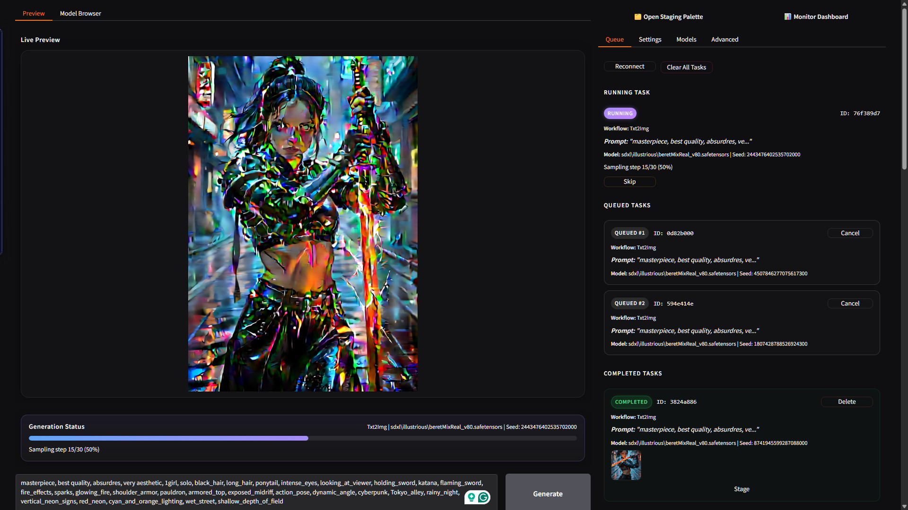

**Preview** is the main generation surface. It keeps the active image large
enough to evaluate while showing diffusion progress, the current workflow,
model, seed, and sampling state. The prompt and Generate control remain close
to the image, so text-to-image work does not require moving between separate
pages.

The Queue separates work into running, queued, and completed tasks. Submitting
a task freezes the settings needed for that generation, allowing the next
prompt or image workflow to be prepared while earlier work continues. A
completed task keeps its output and identifying parameters together, and its
images can be sent directly to the Staging Palette for selection or further
work.

Preview and queue presentation are also designed for bandwidth-limited public
tunnels such as Cloudflare Tunnel or Gradio public sharing. The live Preview
request is bounded to the visible panel dimensions, so the server can return a
smaller image instead of sending a full-resolution frame through the tunnel.
Completed queue entries keep the runtime state URL-based rather than embedding
image bytes in every polling response; each thumbnail remains a link to its
full-resolution image. This keeps the frequently refreshed queue metadata
light while preserving access to the original result when it is needed.

Nexfocus also tracks reusable work at a finer level than the visible task.
When a later request keeps the same model and guidance inputs, unchanged model
components and prepared guidance artifacts can remain reusable. A prompt-only
change, for example, can rebuild text conditioning without forcing an
unchanged ControlNet preprocessor result or warm UNet to be recreated.

## 2. Model Browser

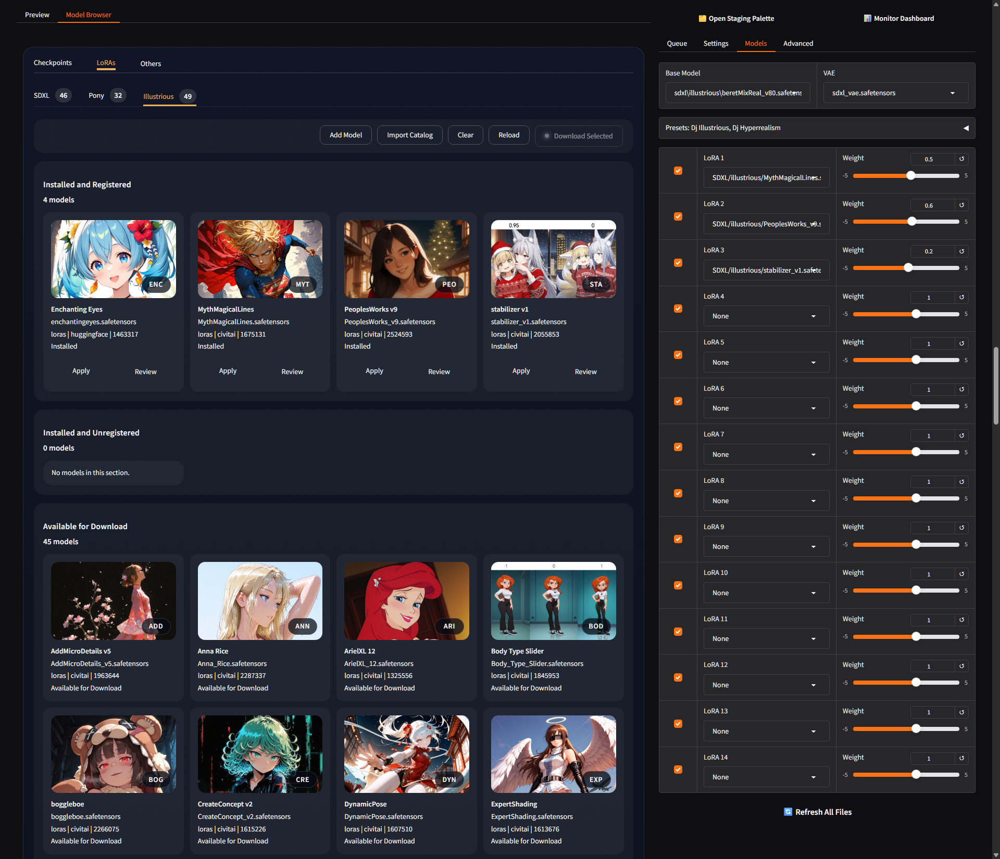

The **Model Browser** brings model discovery and session setup into the
application. Checkpoints, LoRAs, and other catalogue assets can be browsed by
family, reviewed as visual cards, downloaded in batches, registered, and
applied to the active model controls without leaving Nexfocus. Personal
catalogues can add selected files from CivitAI, Hugging Face, or GitHub
alongside the supplied catalogue.

This is convenient on any system, but it is especially valuable in Colab.
Cloud sessions are temporary, and every manual download or file transfer
consumes time from the same session used for generation. In-app model
management keeps that setup inside the running application and reduces the
chance of losing a useful session to a broken transfer or repeated manual
configuration.

> CivitAI catalogue and API downloads require a valid `CIVITAI_TOKEN`.
> Credentials are configured outside the browser and should never appear in a
> screenshot or recording.

## 3. Upscale

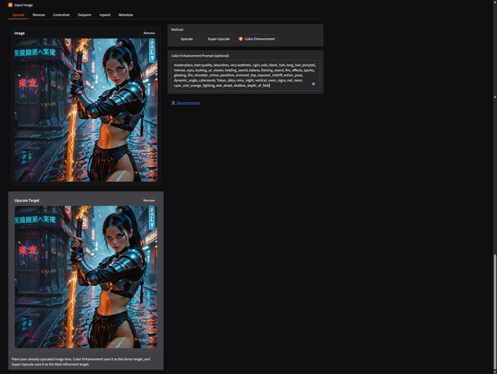

The **Upscale** workspace provides three related but distinct finishing paths.
**Upscale** runs a selected dedicated upscale model and exposes its scale
override and tile size. This is the direct path for quickly increasing
resolution, with lighter models favoring speed and larger models favoring
fidelity.

**Super-Upscale** accepts an already upscaled image in the **Upscale Target**
slot and performs tiled SDXL refinement over that supplied target. Refinement
denoise controls how far the result may move from the target, while tile
overlap helps maintain continuity across the larger canvas. This separates
resolution enlargement from diffusion refinement, so the artist controls the
exact image being refined.

**Color Enhancement** also uses the original image and a supplied upscaled
target, but for a different purpose. Nexfocus runs a low-denoise SDXL color
pass from the original, then uses wavelet reconstruction to combine its
low-frequency color with the target's high-frequency structure. The result
retains the detail of the dedicated upscaler while recovering richer and more
coherent color from SDXL.

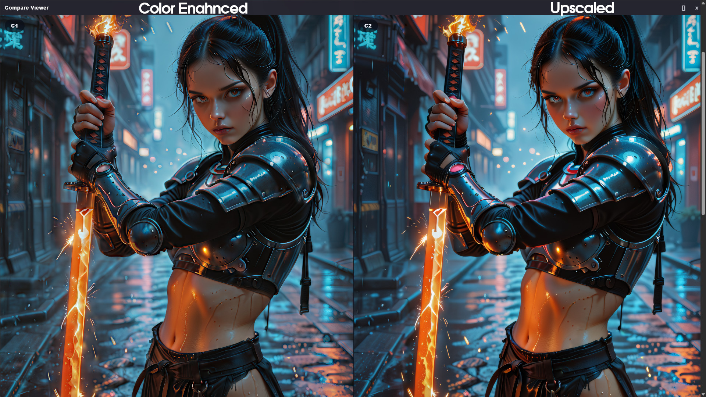

## 4. Remove

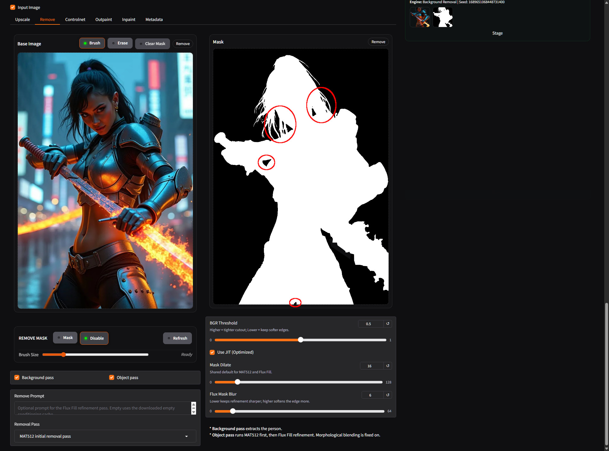

The **Remove** workspace treats background and object removal as preparation
for continued artistic work, not merely as one-click cleanup. Background
removal isolates the main subject using the InSPyReNet-based background pass.
The threshold controls whether the cutout holds tightly to the subject or
retains softer edge detail.

Object removal begins from a painted or supplied mask. The available removal
passes distinguish the MAT512 initial pass from Flux Fill refinement, with
mask dilation and blur controls shaping the region handed to the selected
route. The optional prompt can tell Flux Fill what should replace the removed
area rather than leaving that decision implicit.

The delivered capture intentionally shows **Background pass** and **Object
pass** enabled together. The red circles mark holes in the resulting mask.
This is the danger of the combined path: the two passes can interact in ways
that leave missing regions. For predictable isolation, use one pass at a time
when possible, and always inspect or refine the mask before running a combined
pass.

When a single pass is selected and the mask has been reviewed, the practical
result is a clean layer boundary. Subjects can move into a composite,
unwanted objects can be replaced, and the prepared image can go through
Staging to GIMP or directly into another Nexfocus image workflow. Layer
separation and compositing are fundamental artist operations, so these tools
are part of the main workflow rather than an accessory.

## 5. ControlNet and Image Prompt

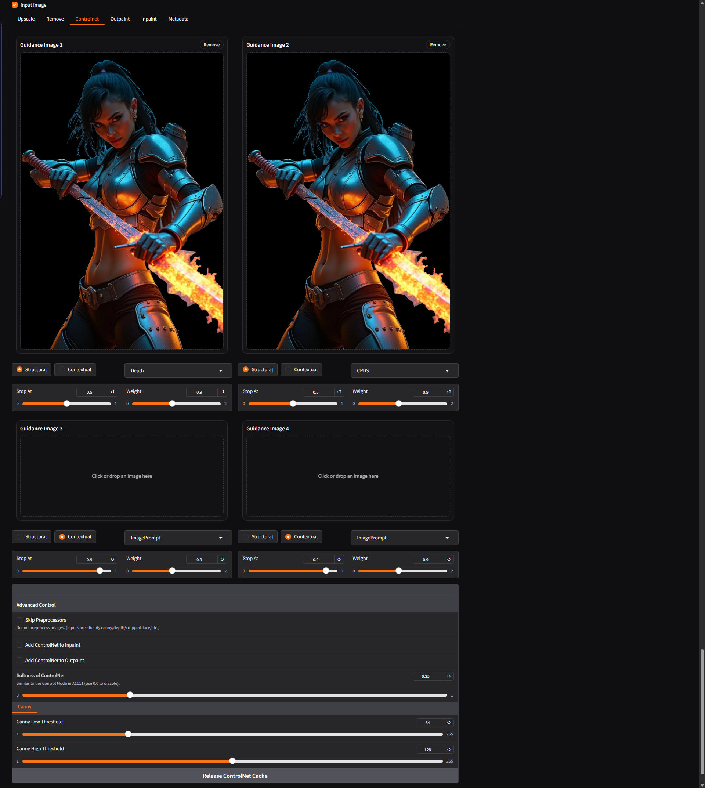

The visible tab is named **Controlnet**. It provides four independent guidance
slots, each with a channel, method, **Stop At**, and **Weight**. Structural
guidance includes **PyraCanny**, **Depth**, and **CPDS**. Contextual guidance
includes **ImagePrompt** and **PuLID**. Multiple slots can describe different
parts of the same intent, such as preserving an edge layout while also
carrying depth or reference-image information.

Weight controls how strongly a guidance input influences generation. Stop At
controls how far through diffusion that influence remains active. Advanced
controls can accept an already prepared map, adjust ControlNet softness and
Canny thresholds, or release cached ControlNet resources when the artist is
finished with them.

ControlNet guidance is not limited to text-to-image. The SDXL inpaint and
outpaint workflows can opt into the same configured guidance slots through
**Add ControlNet to Inpaint** and **Add ControlNet to Outpaint**. Flux Fill is
a separate route and does not accept the SDXL ControlNet overlay.

## 6. Outpaint

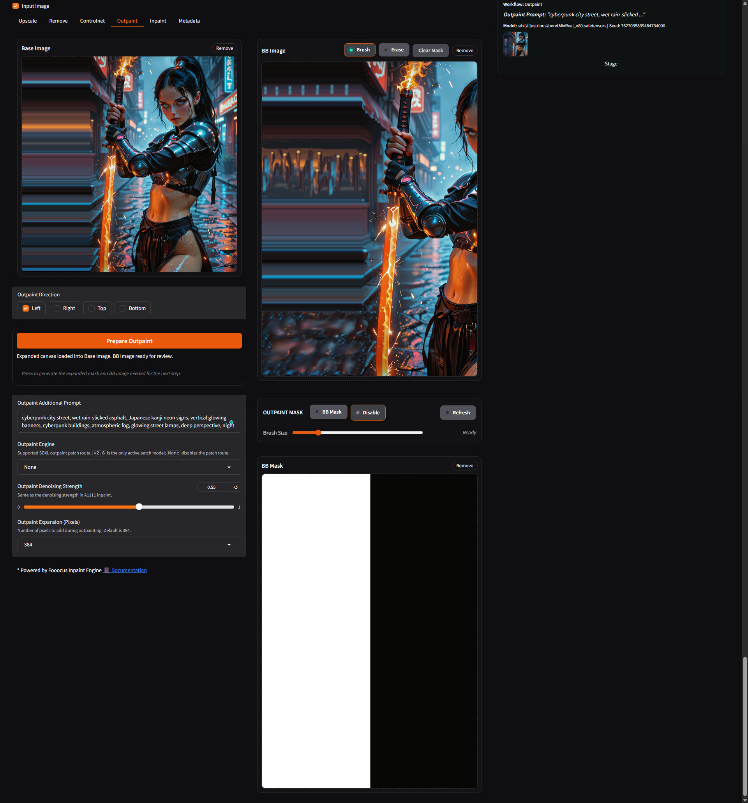

The **Outpaint** workspace extends an image beyond its current canvas. The
artist chooses a direction, an expansion size, a denoising
strength, and a prompt describing the new area. **Prepare Outpaint** then
creates the expanded working image together with a **BB Image** and **BB
Mask** that make the new region explicit before inference begins.

Nexfocus initializes the extension by replicating the source edge into the new
canvas. This immediately carries relevant colors from the source, but it also
produces a strong directional pattern. The BB Image is therefore a reviewable
and replaceable working asset rather than a hidden intermediate.

For a straightforward extension, the prepared assets may already provide
enough context. For a more deliberate composition, the BB Image can be edited
externally and returned with rough divisions, color areas, or boundaries. The
dedicated [Boundary-Guided Outpaint](#boundary-guided-outpaint) example below
shows how little detail is needed before the model takes over.

## 7. Inpaint

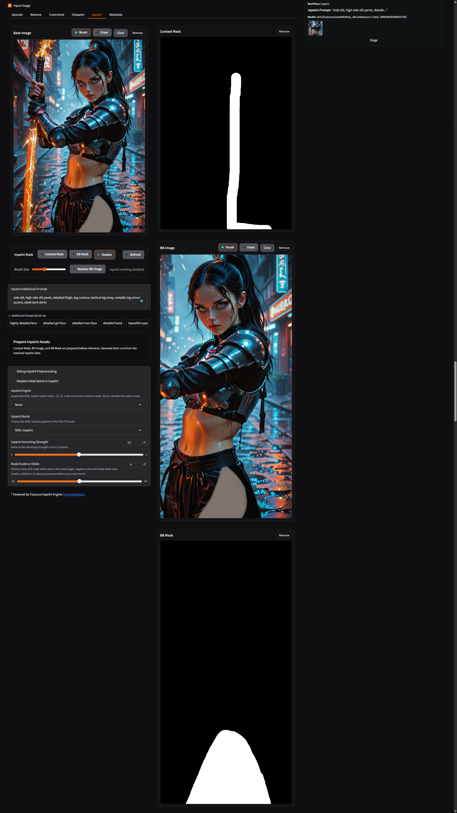

The **Inpaint** workspace separates region selection from inference context.
First, the artist paints a **Context Mask** over the source image. That mask
defines the area involved in the edit. Nexfocus then prepares the corresponding
**BB Image** and **BB Mask**, which define the bounded image context and exact
generation mask used by the selected route.

This two-step design matters because an inpaint model responds to what it can
see, not only to the white area of a mask. **Replace BB Image** rebuilds the
prepared image from the current source and Context Mask, while the exposed BB
Image can also be replaced with an artist-edited version. Changing that image
changes the context supplied to inference without requiring the base image or
masking decision to be reconstructed.

The **Inpaint Route** selects either SDXL Inpaint or Flux Fill. SDXL uses the
active SDXL checkpoint and can optionally receive the ControlNet overlay.
Flux Fill uses its dedicated pipeline and does not accept that overlay. In
both cases, the additional prompt, denoising strength, and mask
erosion/dilation controls remain local to the targeted edit.

This exposed-context workflow is also the basis of
[Color Guidance](#color-guidance).

## 8. Metadata

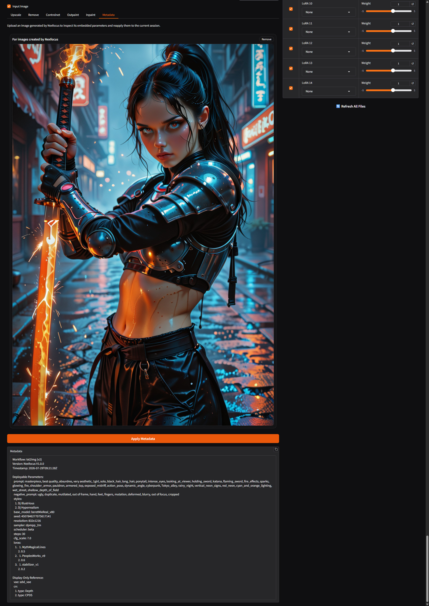

The **Metadata** workspace turns a saved Nexfocus image back into a reusable
generation record. Dropping an image into the metadata slot reveals its
embedded prompt, seed, model, sampler, scheduler, style, resolution, LoRAs,
and workflow-specific values in a readable JSON view.

**Apply Metadata** restores the supported values to the current session. This
makes an output a practical starting point: its prompt can be revised, its
seed can be held for comparison, or its model and LoRA choices can be reused
without reconstructing the generation by hand. The imported values remain
visible controls, so the artist can review them before submitting another
task.

## Staging, Comparison, and GIMP

The **Staging Palette** is the working set that connects Nexfocus workflows.
Completed queue results, uploaded images, and images returned from external
editing can be collected there without changing the active generation tab.
Staging is deliberately separate from the task queue: the queue records work,
while Staging holds the images selected for the next artistic decision.

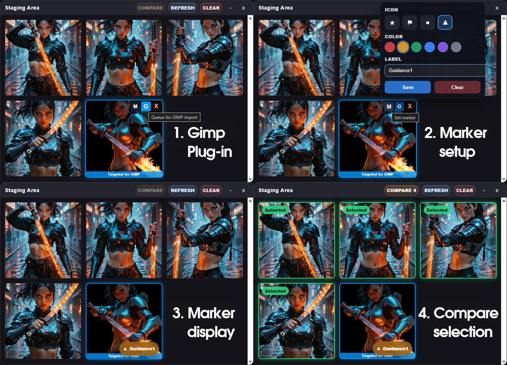

Selected staged images can open in the **Compare Viewer**, where synchronized
zoom and pan keep the same details aligned while candidates are inspected.
This is useful for evaluating pose, edge quality, facial detail, lighting, or
small differences between seeds before choosing a source for inpaint,
outpaint, or upscale.

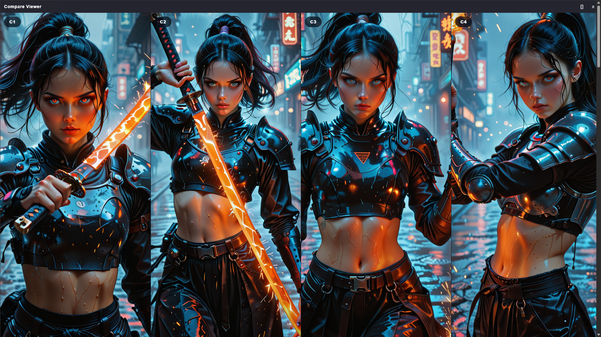

The companion GIMP plug-in completes the round trip. Images targeted in
Staging can be received as GIMP layers, and the active edited layer can be
sent back to Staging. Nexfocus does not attempt to reproduce a full image
editor inside the browser; it connects generation-specific preparation and
inference to the mature selection, paint, transform, and compositing tools
already available in GIMP.

## Color Guidance

**Color Guidance** is the name used here for a practical inpaint technique,
not a separate model or an industry-standard ControlNet method. The idea is
that the model already knows how to render detailed objects, materials, and
anatomy. The artist's problem is often to provide enough spatial and color
context for that knowledge to appear in the intended place.

The process begins with an ordinary Context Mask and prepared BB Image. The
artist paints a rough silhouette or color block directly onto the BB Image
and identifies the intended object or detail in the inpaint prompt. The
painting does not need finished edges, texture, or correct internal detail.
It supplies position, approximate shape, local colors, and surrounding
context; the model supplies the rendering.

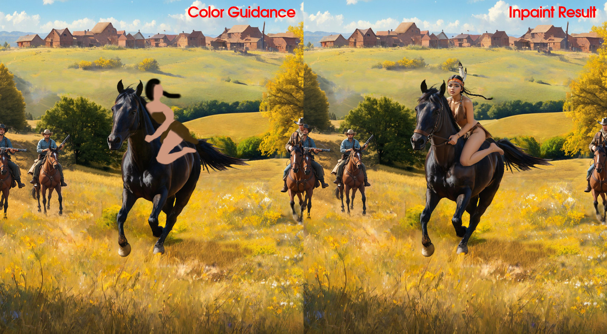

Color Guidance and ControlNet solve different problems. ControlNet is useful
when a formal edge, depth, pose, or reference-image signal should guide
generation. Color Guidance is lighter and more direct when an artist can
express the desired local change with a few painted shapes. Depending on the
edit, it can be used before ControlNet or instead of adding another guidance
model.

## Boundary-Guided Outpaint

**Boundary-Guided Outpaint** applies the same principle to canvas expansion.
The automatically prepared BB Image already carries the source palette into
the extension, but its replicated edge produces a repetitive directional
pattern. The artist first breaks that repetition, then places only the major
boundaries needed to describe the new composition.

Those marks are layout instructions rather than finished artwork. A division
can indicate where a building ends, where the street begins, or where a
bright region should interrupt a dark one. The outpaint prompt identifies the
scene, the edited BB Image establishes its spatial organization and palette,
and the original image supplies continuity.

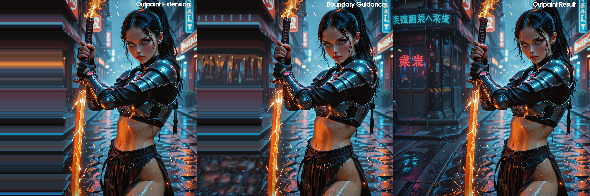

Once the edited BB Image and BB Mask return to Nexfocus, the model replaces
the temporary guide with rendered architecture, materials, lighting,
reflections, and fine detail. The boundaries do not need to be accurate
enough to survive into the final image; they only need to give generation a
better structure to resolve.

## Related Documentation

- [README](readme.md): project identity, architecture story, and release overview
- [Installation Guide](INSTALL.md): Windows, Linux, and Colab setup
- [GIMP Plug-in Guide](plugins/gimp/README.md): GIMP 2.10 and 3.0 installation and round-trip workflow
- [Usage Notes](USAGE.md): practical interactions, hotkeys, runtime behavior, and first-recovery guidance
- [Prompt Presets](PROMPT_PRESETS.md): exact expansion text for every shipped prompt preset
