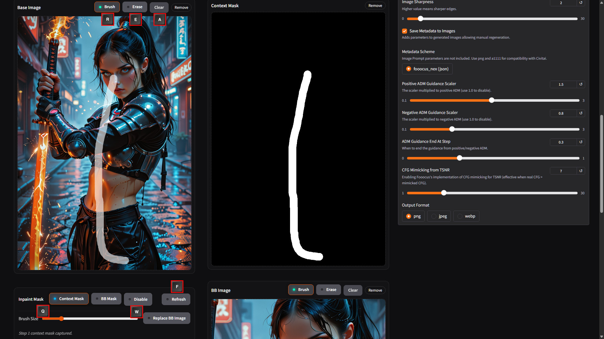
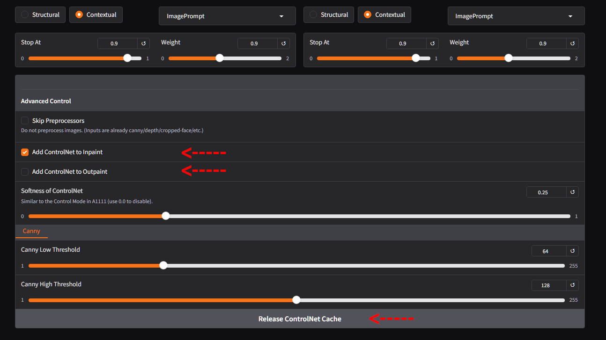
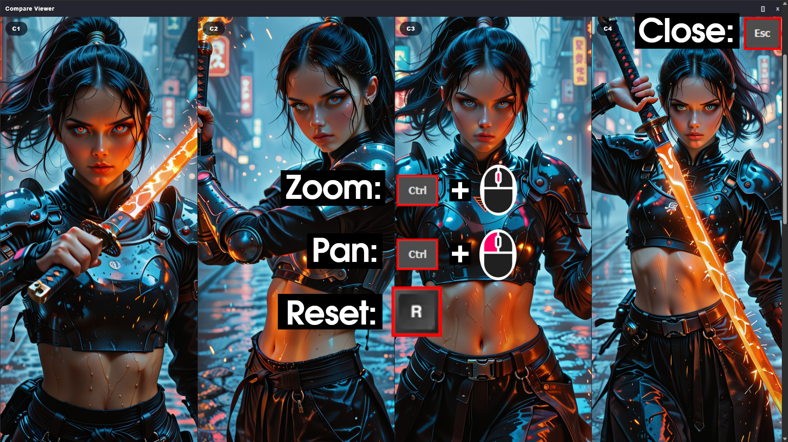
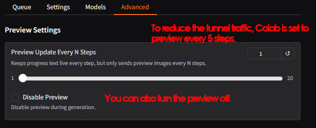
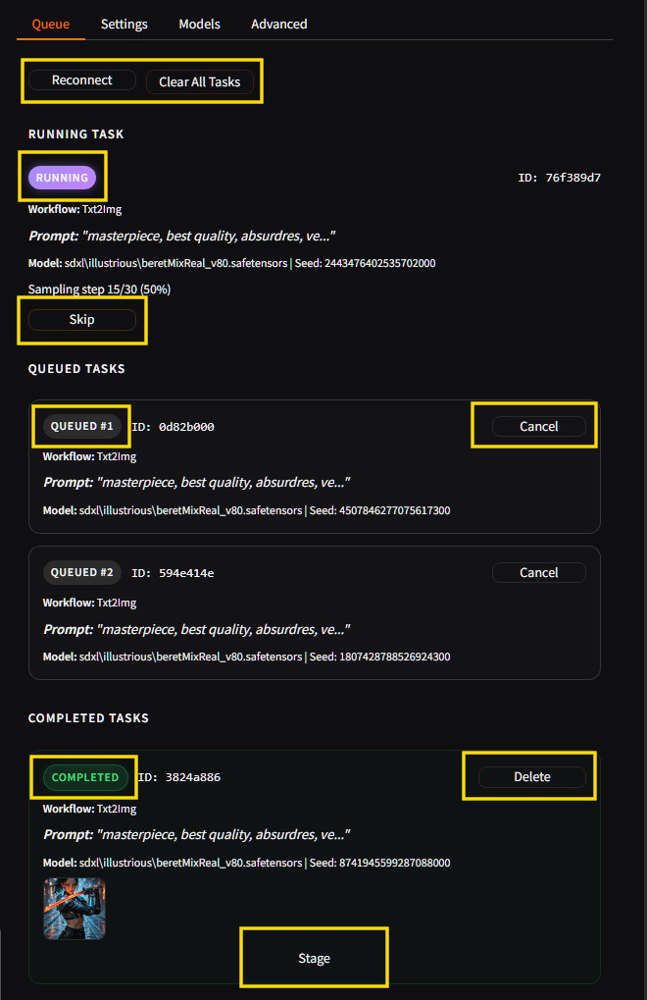
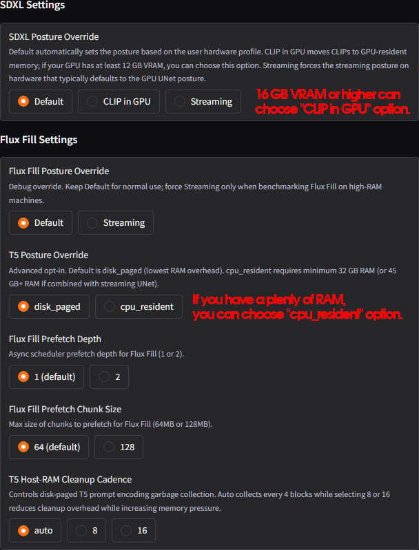
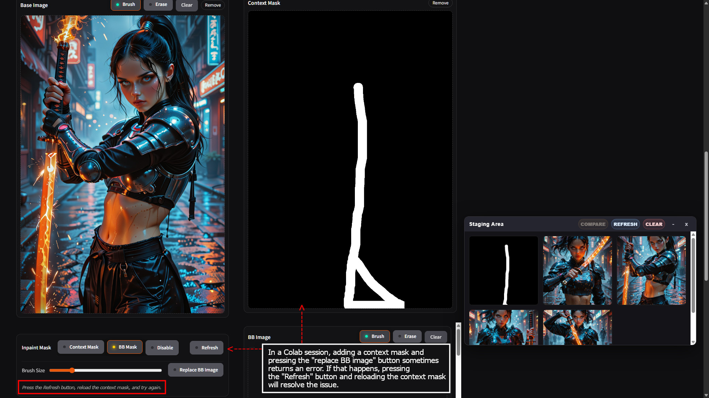

# Nexfocus Practical Usage Notes

These notes cover the interactions and runtime behavior that are easy to miss
while using Nexfocus: keyboard shortcuts, prepared mask assets, which prompt
applies where, queue and preview behavior, runtime posture settings, and the
first recovery step when something looks wrong. They assume the application
is already installed and running.

The companion documents own their own subjects and are not repeated here:

- [FEATURES.md](FEATURES.md) is the visual tour of every workspace.
- [INSTALL.md](INSTALL.md) owns installation, environment setup, and launch.
- [plugins/gimp/README.md](plugins/gimp/README.md) covers GIMP plug-in
  installation and the layer exchange workflow.
- [PROMPT_PRESETS.md](PROMPT_PRESETS.md) lists the exact expansion text of
  every shipped prompt preset.

## Masking Shortcuts

The masking shortcuts are the fastest way to paint, trim, and reset masks:

| Key | Action |
|-----|--------|
| `R` | Select the brush |
| `E` | Select the eraser |
| `A` | Clear the active mask |
| `Q` | Decrease brush size (4 px per press) |
| `W` | Increase brush size (4 px per press) |
| `F` | Refresh and rebuild the masking surface |

These bindings apply to every mask surface: the Inpaint Context Mask, the
Inpaint BB Mask, the Outpaint BB Mask, and the Remove mask. A mask mode must
be active (not Disabled) for the shortcuts to fire. They also do not fire
while focus is inside a text field, text area, or select control, because the
browser sends those keys to the control instead; click back onto the image
and the shortcuts respond again. Open overlay interactions, such as the
Compare Viewer or the Staging marker picker, also suspend mask shortcuts
until they are closed.

- **Erase versus clear:** the eraser removes paint only where you stroke;
  `A` clears the entire active mask. Use the eraser to trim a region and
  `A` when you want to start over.
- **`F` as recovery:** `F` rebuilds every mask canvas and rebinds the
  controls. Use it when a mask overlay is missing, misaligned, or
  unresponsive after the layout changed or images were reloaded. It does not
  reset the source image or the prepared assets.
- **Context Mask versus BB Image versus BB Mask:** the Context Mask marks the
  area involved in the edit. The BB Image is the bounded image context
  prepared from your source and mask, and the BB Mask is the exact generation
  mask for that bounded area. They are separate assets, and the prepared BB
  assets are what the selected route actually consumes. Inspect them before
  submitting inference, especially after replacing or editing the source.

See [FEATURES.md](FEATURES.md) for the full Inpaint and Outpaint walkthroughs
that show these assets in context.

## Prepared Assets and the Order That Matters

### Inpaint

1. Load a source image and paint the Step 1 Context Mask.
2. Nexfocus prepares the BB Image and BB Mask from it.
3. **Replace BB Image** rebuilds the BB Image from the current source and
   Context Mask, so use it after changing either one.

The context mask can occasionally leave the prepared assets out of sync when
it is added inside a Colab session. When this happens, the UI status line
tells you exactly what to do: press Refresh, reload the context mask, and try
again. Do that rather than retrying generation. This is a state-sync recovery
step, not a failure of the model or the route.

### Outpaint

Outpaint always expands the canvas first, so press **Prepare Outpaint** before
anything else in the tab. It creates the expanded canvas, loads it into the
Base Image slot, and produces a BB Image aligned to that expanded canvas.
The BB Mask and any BB Image replacement only make sense after this
expansion, because the base image also needs to be expanded and aligned to
the BB image. If you replace the BB image or paint the mask without expanding
first, the pieces will not line up. After preparing, paint the Step 2 BB Mask
and optionally edit or replace the BB Image with rough composition marks;
the model renders the final details during inference.

### Remove

The Remove tab works from one mask. For predictable isolation, use one pass at
a time (Background or Object) and inspect or refine the mask before running a
combined pass; the combined path can leave holes where the two passes
interact. See [FEATURES.md](FEATURES.md) for the delivered Remove example.

### ControlNet on Inpaint and Outpaint

Guidance slots in the Controlnet tab are not applied to image workflows
automatically. Enable **Add ControlNet to Inpaint** or **Add ControlNet to
Outpaint** in the Controlnet tab, or the configured slots will simply not
apply to those tabs. Flux Fill does not accept the SDXL ControlNet overlay;
the app asks you to switch Inpaint to the SDXL route or turn the checkbox off
when both are active.

The **Release ControlNet Cache** button in the Advanced Control area frees
the memory held by loaded ControlNet models and prepared guidance maps once
you are finished with them. It runs as a quick background task and reports
`Releasing ControlNet Caches...` in the status line until it finishes. This
is a memory-reclaim convenience, not a required step: the next
ControlNet-enabled task reloads or reprocesses whatever it needs.

## Compare Viewer and Staging Palette

The Compare Viewer compares up to four selected staged images with a shared
camera:

- `Ctrl+Scroll` zooms every viewport together.
- `Ctrl+Left Drag` pans every viewport and is active once you are zoomed
  above 1x.
- `R` resets the camera to 1x and centers it.
- `Escape` closes the viewer.
- The window button toggles between full-window and compact windowed
  presentation; in compact mode the panel can be dragged and resized.

The Staging Palette is the working set that feeds comparison and external
editing. The palette itself is shown in
[FEATURES.md](FEATURES.md); the interactions worth knowing are:

- **Stage** on a completed queue task sends its images to the palette. You
  can also drag and drop image files or URLs onto the palette directly.
- Click a staged item to select it; select up to four, then press **Compare**
  to open the viewer.
- **Refresh** re-reads the palette state; **Clear** removes every staged
  image after a confirmation.
- The `M` button opens the marker picker (icon, color, and an optional label);
  `Escape` closes it. The `G` button queues the image for GIMP import, and
  the GIMP plug-in receives the targeted layer and can send an edited layer
  back.
- **Minimize** collapses the palette, **Restore** expands it again, and
  **Close** hides it.
- Closing the palette does not delete anything. Staged images remain in the
  palette and reappear when you reopen it from the top button. This is
  separate from the queue: clearing Staging only removes the working copies,
  while deleting a completed task only removes that record from the Queue.
  Neither deletes saved output files.

## Which Prompt Applies

Each workflow reads the prompt from a specific place, and it is easy to fill
the main prompt and wonder why an edit did not use it:

| Workflow | Prompt used |
|---|---|
| Txt2Img | Main prompt |
| Inpaint | Main prompt plus the Inpaint Additional Prompt |
| Outpaint | Main prompt plus the Outpaint Additional Prompt |
| Remove | Remove Prompt only (main prompt is ignored) |
| Upscale | None (the basic GAN upscale does not run prompt-conditioned diffusion) |
| Super-Upscale | Main prompt, including the selected prompt presets |
| Color Enhancement | Upscale Prompt field in the Upscale tab (main prompt is ignored, but the main negative prompt still applies) |

## Prompt Presets

The Models panel has a **Prompt Presets** accordion. A preset can insert your
prompt into a template, add independent positive guidance alongside it, add
negative guidance, or combine those effects. Several presets can be active at
once, and the default selections are **Fooocus Enhance** and **Fooocus
Sharp**. The search box filters the list. Because presets change what is
actually sent to the model, changing the selection changes results even when
the prompt text stays the same. See
[PROMPT_PRESETS.md](PROMPT_PRESETS.md) for the exact expansion text of every
shipped preset.

## Preview and Queue Behavior

- **Preview Update Every N Steps** (Advanced tab) changes how often a new
  preview image is sent. Progress text remains live every step, so the number
  and message stay current even between images. The default is 1.
- **Disable Preview** turns off intermediate preview images entirely.
  Generation continues normally; this setting only saves image traffic.
- Preview images are bounded to the visible panel dimensions, so the server
  returns a smaller frame through bandwidth-limited public tunnels such as
  Cloudflare or Gradio sharing. Completed queue entries carry image URLs
  rather than embedding image bytes in every poll, and each thumbnail links
  to the full-resolution result. The small thumbnail is rendered by CSS from
  that same full-resolution URL; it is not itself a reduced download.
- A submitted task freezes the settings that belong to it. Later UI edits
  apply to the next submission, never to the task already running or waiting.

The Queue separates three states:

- **Running** is the task being processed. **Skip** stops it and moves on.
- **Queued** tasks are waiting; **Cancel** removes a single queued task.
- **Completed** tasks hold finished outputs. **Delete** removes the record
  from the list, and **Stage** sends the outputs to the Staging Palette.
- **Clear All Tasks** stops the active task and removes every waiting task.
  Completed records remain until you delete them individually.
- **Reconnect** forces the runtime surface to re-read the current state from
  the backend. Use it when a public-tunnel UI stops updating; check the
  console for errors before restarting the whole process.

## Runtime Postures and Expected Reloads

**Default/Auto is the recommended normal choice.** It lets the application
pick the posture from the detected hardware profile.

- **SDXL Posture Override** (Advanced tab): Default, CLIP in GPU, or
  Streaming.
- **CLIP in GPU** moves text encoding to GPU-resident memory. It is intended
  for machines with enough VRAM; the UI suggests at least 12 GB. On a
  higher-headroom machine such as Colab Pro, this is one of the two posture
  settings worth revisiting, because it can speed up prompt encoding when
  VRAM allows.
- **Streaming** (SDXL) forces the streaming posture, useful mainly when the
  default GPU-resident posture cannot fit the active model.
- **Flux Fill Posture Override**: Default or Streaming. Streaming is an
  advanced debug override for high-RAM benchmarking, not a default
  recommendation.
- **T5 Posture Override**: `disk_paged` (default, lowest host-RAM footprint)
  or `cpu_resident` (keeps the FP16 T5 encoder resident for faster prompt
  encoding, with a higher RAM requirement). `cpu_resident` is only offered
  when the current RAM gate permits it. On Colab Pro this is the second
  posture setting worth revisiting.
- **Flux Fill Prefetch Depth**, **Flux Fill Prefetch Chunk Size**, and
  **T5 Host-RAM Cleanup Cadence** are advanced tuning controls. Leave them at
  their defaults unless you are deliberately testing memory or performance
  tradeoffs.

Changing the model family, checkpoint, LoRA stack, or posture can invalidate
reusable runtime state. The next task may pause while the model is released,
reloaded, transferred, or re-encoded, and the console reports the switch as it
happens. This is expected behavior, not a hang. The change is captured when a
task is submitted, so it never retroactively alters work already submitted.

## Metadata, Logs, and First Recovery Steps

- **Apply Metadata** (Metadata tab) restores the supported generation
  controls from an image's embedded record. Review the model and LoRA choices
  before resubmitting; if a checkpoint or LoRA is not installed, the dropdown
  shows only the options that are actually available, so select an available
  replacement.
- Normal console output reports user-facing progress and keeps the complete
  traceback for genuine failures. Copy the failing block when seeking help.
- `--debug-mode` adds internal diagnostic telemetry. It is appropriate when a
  reproducible failure needs deeper support evidence; it is not needed for
  ordinary use.
- Predictable missing-input or incompatible-route messages (for example, Flux
  Fill with an active Inpaint ControlNet, or a missing required image) are
  correction guidance, not backend crashes.

### Quick symptom and first-action table

| Symptom | First check or action |
|---|---|
| Preview images appear infrequently | Check **Preview Update Every N Steps** |
| Progress continues with no preview image | Check **Disable Preview** and tunnel connectivity |
| Compare will not pan | Zoom above 1x and hold `Ctrl` while dragging |
| Mask shortcut does nothing | Move focus out of text or select controls; use `F` only if the mask surface needs rebuilding |
| Context mask will not apply after adding it | Follow the status line: press Refresh, reload the context mask, then prepare again |
| Outpaint BB mask or image will not line up | Run **Prepare Outpaint** first so the base canvas is expanded and aligned |
| Next task pauses before inference | Check for model, LoRA, family, or posture changes that require a reload |
| Staging appears stale | Use **Refresh**; distinguish Staging state from queue state |
| Public-tunnel UI stops updating | Use **Reconnect** and inspect the console before restarting the process |
| Metadata applies but an asset is unavailable | Review installed checkpoint and LoRA choices and select an available replacement |
