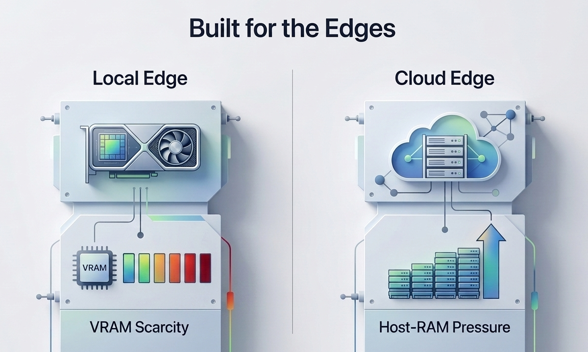
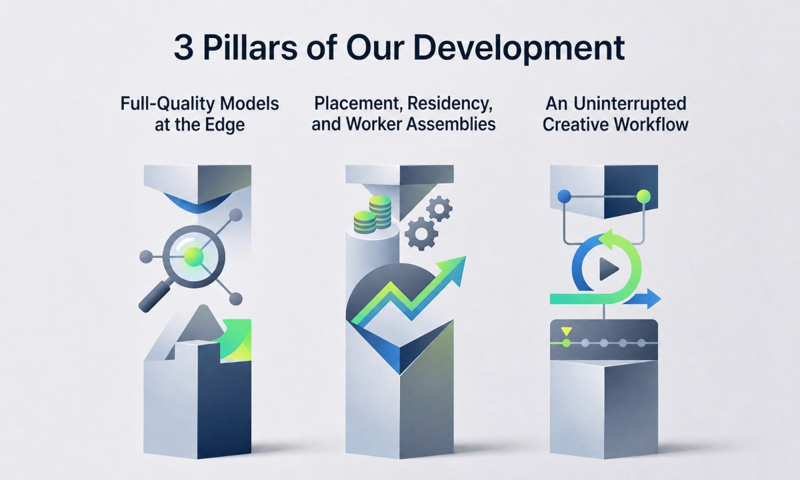
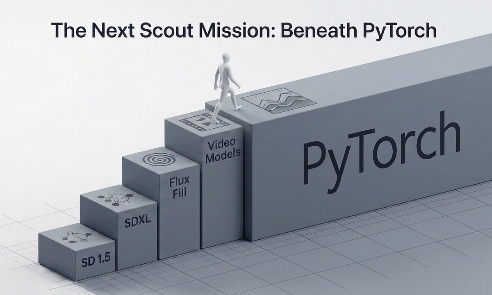

# Nexfocus

> **A field notebook from a deep expedition into image-generation infrastructure, built for the edges and pressure-tested on constrained hardware.**

Nexfocus is a complete image-generation application centered on SDXL, with generation, inpainting, outpainting, upscaling, object removal, image
conditioning, LoRA support, and metadata-aware workflows. It began as a fork of [Fooocus](https://github.com/lllyasviel/Fooocus), then grew into an
investigation of how models load, how memory moves, how pipelines execute, and what changes when the application takes ownership of those decisions.

---

## Feature Walkthrough

Experience the connected Nexfocus image creation and post-processing pipeline in action. The walkthrough video demonstrates session-aware model management, GIMP layer exchange, ControlNet guidance, inpaint detail editing, directional outpainting, GAN upscaling, and SDXL-based color enhancement in a single continuous session.

- **Watch the Connected Workflow:** [Open the walkthrough video on YouTube](https://www.youtube.com/watch?v=5fvIaZWMZE4)
- **Explore the Feature Guide:** See [FEATURES.md](FEATURES.md) for a visual tour of the core workspaces and connected artist workflows.
- **Explore the Usage Guide:** See [USAGE.md](USAGE.md) for practical notes on shortcuts, masks, queue behavior, and runtime postures while using Nexfocus.

---

## Why This Exists

Generative models already contain remarkable visual knowledge, but a model
does not work in isolation. Its useful capability depends on the environment
through which it is conditioned, executed, and given feedback. Text prompting
is valuable, but language alone is a blunt instrument for spatial intent.
LoRAs, masks, ControlNets, reference images, and inpainting are all ways of
changing the environment around the model so that its iterative process can
be steered more precisely.

We chose to understand that environment from the infrastructure upward.
Instead of treating the diffusion pipeline as a black box, we decomposed an
existing application and followed every stage: model loading, text encoding,
conditioning, denoising, decoding, memory placement, reuse, invalidation, and
cleanup. Nexfocus is both the working application produced by that expedition
and the record of what its constraints taught us.

---

## Built for the Edges

The project was developed around a simple belief:

> ### Everyone should be able to use serious image AI, even on an old PC or no PC at all.

Two reference environments turned that belief into hard engineering boundaries:

| Anchor | Hardware | What it exposes |
|:---|:---|:---|
| **Local edge** | NVIDIA GTX 1050, 3 GB VRAM, 32 GB RAM | VRAM scarcity, transfer cost, allocator behavior, and the real price of every duplicate tensor |
| **Cloud edge** | Google Colab Free T4, 16 GB VRAM, 12.7 GB system RAM | Host-RAM pressure, one-cell execution, session loss, and the need to use GPU memory differently |

These environments are constrained in opposite ways. The local machine has enough system RAM but almost no VRAM. Colab Free has a much larger GPU but a tight host-RAM ceiling and an ephemeral session. That difference became central to the architecture: there is no single loading policy that is efficient in both places.

At the edge, hidden duplication and vague lifecycle ownership become visible.
Designing there forced the pipeline to account for the resources it actually uses rather than the resources a high-level framework appears to expose.

---

## Engineering Breakthroughs

The technical story is organized around three pillars. SDXL is the primary model and proving ground. Flux Fill and its T5 encoder are separate production runtimes that tested whether the same principles could survive a larger and more demanding model family.

### Pillar I: Full-Quality Models at the Edge

#### 1. SDXL: from quantized survival to FP16 streaming

- **The Feat:** A complete, ecosystem-standard FP16 SDXL checkpoint can run through the streaming assembly on the 3 GB GTX 1050 development machine.
- **The Evolution:** The path began with Q4 SDXL, progressed through Q5 and Q8, and ultimately reached FP16. Each increase in precision exposed another weak point in loading, placement, dispatch, or cleanup. Solving those weak points is what made the current streaming architecture possible.
- **Why It Matters:** SDXL models are normally distributed as complete FP16 checkpoints. Users do not need separately prepared quantized UNet and text components merely to fit the runtime.
- **How It Works:** The streaming assembly constructs the UNet shell without first materializing a second full model, progressively realizes FP16 weights from the checkpoint, keeps the authoritative model state in host memory, and moves the active working set through the GPU during denoising. The VAE and supporting workers use transient lifecycles so their peak memory does not become permanent residency.

Q4, Q5, and Q8 were essential steps in the expedition, but they are historical architecture milestones rather than the current SDXL product format. The supported SDXL path is now the unified FP16 safetensors pipeline.

#### 2. Flux Fill streaming on 3 GB VRAM

- **The Feat:** The 12.7 GB Flux Fill UNet executes on the same 3 GB GPU using its dedicated native FP8 streaming runtime.
- **The Insight:** Model size does not need to equal active VRAM occupancy. Once the pipeline owns allocation and transfer timing, weight locality becomes a scheduling problem rather than a hard capacity requirement.
- **How It Works:** Stage-contracted workers control the model's memory lifecycle and stream the required weights through bounded GPU allocations. Flux Fill remains a dedicated runtime because its model structure and resource requirements are different from SDXL's; it shares principles with SDXL without being forced into the same internal implementation.

#### 3. FP16 T5-XXL disk paging

- **The Feat:** Flux prompt conditioning can use the 9.5 GB T5-XXL encoder at FP16 precision within Colab Free's 12.7 GB system-RAM ceiling.
- **The Decision:** Rather than make quantized T5 the default and accept a possible conditioning-quality tradeoff, Nexfocus keeps FP16 as the primary path and treats lower-precision assets as compatibility fallbacks.
- **How It Works:** T5 weights are read in managed pages instead of being materialized as one complete host-RAM tensor. Disk becomes an explicit memory tier whose lifetime is owned by the text-encoding worker.

> ### **Quality should not be reduced merely to satisfy the hardware. The infrastructure should first be asked whether full quality can be made to fit.**

---

### Pillar II: Placement, Residency, and Worker Assemblies

Image pipelines are commonly described as loading a model onto the GPU and offloading it when memory is needed elsewhere. Nexfocus does perform data movement, but its architecture is not organized around one universal load/offload cycle. It loads components differently according to the environment, the model family, and the stage being executed.

#### 4. One SDXL contract, different assemblies

- **The Feat:** SDXL streaming and SDXL resident execution operate behind one Nex-owned pipeline contract while using different worker compositions and memory lifecycles.
- **The Insight:** A common application interface does not require one execution architecture. Low-VRAM streaming and high-headroom residency have different useful operating points.
- **How It Works:** A frozen request selects an assembly of independently owned workers: UNet spine, text encoder, LoRA patcher, VAE, and any task-specific support workers. Each worker owns its artifacts, reuse keys, invalidation rules, and cleanup boundary.

This assembly-first model grew from repeatedly finding that expensive behavior was hiding outside model computation: framework dispatch, duplicated tensor state, broad component caches, and lifecycle decisions made by layers that did not understand the active task.

#### 5. CPU and GPU text-encoder workers

The two edge environments invert the usual assumptions about where text encoding belongs:

- On the local edge, CPU-side text encoding protects the GTX 1050's scarce VRAM for denoising.
- On Colab Free, GPU-side text encoding uses the T4's available VRAM and protects the much tighter system-RAM budget.
- A GPU-pinned text worker does not retain an unnecessary CPU shadow copy.
- Text state, prompt conditioning, UNet state, and VAE state can be retained or released independently rather than as one indivisible pipeline bundle.

The goal is not to minimize the use of any one device. It is to use CPU, GPU, system RAM, VRAM, and storage where each is most useful at that moment.

#### 6. Shadow-copy avoidance and transient workers

A model that appears to fit can still fail when loaders, patchers, or framework caches preserve hidden twins of its weights. Nexfocus makes shadow-copy policy an explicit runtime decision.

Resident GPU postures can load directly without retaining a full CPU UNet twin. Streaming postures preserve the host-side authority they need without holding an unnecessary device-resident copy. VAE, ControlNet, and auxiliary workers can use otherwise idle GPU capacity transiently, then release it before the next stage. Memory is assigned to the active computation rather than reserved by habit.

---

### Pillar III: An Uninterrupted Creative Workflow

Infrastructure matters when it removes interruption. Nexfocus preserves components and artifacts that remain valid, invalidates only the state that actually changed, and keeps model-management and image-editing tasks close to the running generation session.

#### 7. Session-aware Colab operation

Colab Free normally creates an awkward choice: stop the application cell to download another model and risk losing the GPU session, or remain connected and keep using the models already present. Nexfocus turns model management into part of the live application.

Users can browse model catalogues, inspect thumbnails, start background downloads, and switch presets without leaving the running web UI. In an ephemeral environment, this is not merely convenience; it is session preservation.

#### 8. User-first pipeline behavior

- **Component-aware LoRA patching:** UNet and CLIP adaptations are tracked independently, so a UNet-only LoRA does not force needless CLIP work or a full pipeline rebuild.
- **Responsive masking:** A custom HTML/JavaScript overlay replaces the heavy Gradio image-editor path for fluid inpaint and object-removal masks.
- **Staging and comparison:** A floating staging palette and comparison viewer keep iteration, selection, and review inside the working session.
- **GIMP layer exchange:** Images and masks can move between Nexfocus and GIMP for external painting and compositing.
- **Metadata round-trip:** Generation parameters survive saving, reloading, and sharing so an image remains connected to the process that produced it.

---

## Production Hardening

Explicit memory ownership creates powerful behavior, but it also creates more contracts that must remain correct. Nexfocus is protected by a maintained suite of automated tests spanning unit, integration, workflow, compatibility, and runtime-policy surfaces.

The release baseline also includes:

- normal and debug logging with different user-facing purposes;
- explicit compatibility bridges for retained legacy settings;
- queue-frozen execution plans so mutable UI state cannot redefine a running task;
- component-level fingerprints and invalidation rules;
- controlled process transitions between SDXL and Flux families; and
- metadata and key-binding verification.

The test suite is not presented as proof that every hardware combination is perfect. It is the maintained contract that lets hardware-specific behavior evolve without silently changing unrelated workflows.

---

## What the Constraints Taught Us

The individual features matter, but the more transferable result is the set of engineering principles that emerged from them:

| Environmental pressure | Architectural response | General lesson |
|:---|:---|:---|
| 3 GB VRAM | SDXL's Q4 → Q5 → Q8 → FP16 streaming evolution | Model precision and total model size need not be bounded by active VRAM capacity |
| 12.7 GB system RAM | FP16 T5 disk paging | Storage can become a managed memory tier when the pipeline owns the read lifecycle |
| Opposite local and Colab constraints | Dedicated CPU- and GPU-pinned text workers | Placement is contextual; there is no universally correct device |
| Hidden framework duplication | Explicit ownership and shadow-copy avoidance | Nominal memory is less important than memory the application can actually reclaim |
| Different hardware tiers | Posture-specific worker assemblies behind one contract | One interface does not require one execution strategy |
| Ephemeral one-cell sessions | In-app model management and background downloads | Workflow continuity is itself a resource-management problem |

The common thread is ownership. Frameworks remain useful mechanisms, but Nexfocus decides pipeline family, worker composition, artifact lifetime, warm-state meaning, and transition policy.

---

## The Next Scout Mission: Beneath PyTorch

Nexfocus has reached the scope it set out to complete. Maintenance mode means that the application has entered a stable product boundary, with critical fixes remaining in scope; it does not mean that the infrastructure expedition has been abandoned. The work is continuing at the next layer where the limiting problems now live.

SDXL and Flux Fill demonstrated that models much larger than available VRAM can run effectively when the application owns placement, movement, and lifecycle. They also exposed the boundary of what can be achieved while working through a general-purpose tensor framework. PyTorch makes advanced models broadly accessible, but its allocator, tensor ownership, and execution assumptions were not designed specifically for severe memory constraints.

Video generation is the clearest next stress test. Video models multiply the same pressures across temporal activations, frame sequences, attention state, and repeated transfers. If the answer remains sheer scaling, these models will continue to demand hardware beyond the reach of most users.

The next scout mission therefore explores a native C++ tensor and memory layer built around explicit allocation, controlled movement across disk, RAM, and VRAM, shadow-copy avoidance, and specialized worker assemblies. The practical objective is the same one that shaped Nexfocus: make larger and higher-dimensional generative models usable on hardware that conventional execution treats as insufficient.

Nexfocus remains the completed application produced by the first expedition. The next mission carries its edge-first principles into territory that the current framework cannot reach cleanly.

---

## Installation

### System Requirements

All configurations require an NVIDIA GPU with updated drivers.

| Workload | GPU Minimum | RAM Minimum | Notes |
|:---|:---|:---|:---|
| SDXL Streaming | GTX&nbsp;1050 3&nbsp;GB | 32&nbsp;GB | Default below 8 GB VRAM |
| SDXL&nbsp;GPU&nbsp;Resident + CPU Text | 8&nbsp;GB | 32&nbsp;GB | Design target; expected to work but not physically verified. Select streaming if issues arise |
| SDXL&nbsp;GPU&nbsp;Resident + GPU Text | 16&nbsp;GB | 16&nbsp;GB | 16 GB GPU floor |
| Flux&nbsp;Fill&nbsp;Streaming + T5 disk-paged | GTX&nbsp;1050 3&nbsp;GB | 32&nbsp;GB | Disk-paged T5 is the default text posture |
| Flux&nbsp;Fill&nbsp;Streaming + T5 CPU resident | GTX&nbsp;1050 3&nbsp;GB | 45&nbsp;GB | Optional faster prompt encoding |
| Flux&nbsp;Fill&nbsp;GPU&nbsp;resident + T5 disk-paged | 16&nbsp;GB | 12.7&nbsp;GB | Default text posture; validated on Colab Free T4 |
| Flux&nbsp;Fill&nbsp;GPU&nbsp;resident + T5 CPU resident | 16&nbsp;GB | 32&nbsp;GB | Optional higher-RAM path |

Storage depends on how many checkpoints and LoRAs you install. For orientation,
one SDXL checkpoint is about 6.5 GB, Flux Fill is about 12.7 GB, and the
FP16 T5-XXL encoder is about 9.5 GB, plus supporting models and dependencies.

> **NVIDIA GPUs only.** Nexfocus currently supports NVIDIA GPUs exclusively.
> If the next scout mission (a native C++ tensor and memory layer) succeeds,
> it will remove the PyTorch dependency that limits us to NVIDIA hardware.

The validated software floor is PyTorch `2.5.1+cu124`. Newer compatible
PyTorch/CUDA and xformers builds are supported; see
[INSTALL.md](INSTALL.md) for the baseline and current-build paths.

### Quick Start

1. Follow the step-by-step guide in [INSTALL.md](INSTALL.md).
2. Run the launcher to verify the environment and start Nexfocus:

   - **Windows:** `launch.bat`
   - **Linux:** `./launch.sh`

The launcher verifies Python 3.10+, the virtual environment, PyTorch with
CUDA, xformers, and uv. It installs only Aria2; all other installation remains
explicit in INSTALL.md.

A CivitAI API token is required for catalogue-driven CivitAI model downloads.
See [INSTALL.md](INSTALL.md) for credential setup. Manually downloaded files
must use the filename and destination expected by the Nexfocus catalogue.

> **Why no portable version?** A portable bundle locks the environment to a
> fixed configuration, makes components and settings harder to change, and
> packages a complete Python installation. Following the installation guide
> produces an environment you can understand, troubleshoot, and adapt.

### Run on Google Colab

| Colab | Info |
| --- | --- |
|  | Nexfocus Official |

No local installation required. The notebook handles all setup automatically.

---

## Documentation

- [FEATURES.md](FEATURES.md) -- Visual feature guide to the core workspaces and connected artist workflows
- [INSTALL.md](INSTALL.md) -- Full installation guide (Windows, Linux, Colab)
- [USAGE.md](USAGE.md) -- Practical interactions, hotkeys, runtime behavior, and recovery notes
- [PROMPT_PRESETS.md](PROMPT_PRESETS.md) -- Reference for every shipped prompt preset and its expansion text
- [CONTRIBUTING.md](CONTRIBUTING.md) -- Developer guidelines and test contract
- [CHANGELOG.md](CHANGELOG.md) -- Version history and key milestones

---

## Credits and License

Nexfocus originated as a fork of [Fooocus](https://github.com/lllyasviel/Fooocus) by [lllyasviel](https://github.com/lllyasviel). We are grateful to its authors and to the wider open-source generative-AI community whose work made this expedition possible.

The project was developed through human-AI pair programming: the visual and systems intuition of an artist working with the implementation and analytical reach of agentic AI collaborators.

Nexfocus is licensed under the
[GNU General Public License v3.0](LICENSE).
